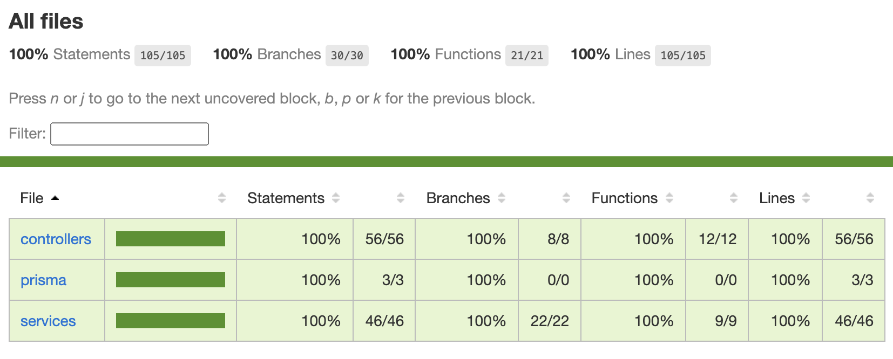

# Backend LogiCRUD


## Description

This backend project is part of a CRUD (Create, Read, Update, Delete) application for category registration. The technology stack includes Node.js with TypeScript for the backend and integrates with a Postgres database. 

## Requirements

- Node.js (v20.11.0)
- npm (v8.15.0)

## Features
#### Categories Table
- Table that records the categories of goods transport vehicles.
#### Category Actions
- Create Category: Adds a new category to the system.
- Edit Category: Updates category information.
- Delete Category: Removes a category from the system.
- List Categories: Retrieves a list of all categories.

## Database
The backend uses PostgreSQL as the chosen database system. This database has been deployed on **AWS RDS**. The URL for the database is:

```json
categories-instance-1.c9ockii843yf.us-east-1.rds.amazonaws.com
```

If you need the credentials to connect to the database, please contact me.

### Installation
#### To run this project locally with PostgreSQL:

- Ensure PostgreSQL is installed on your machine.
- Start the PostgreSQL server locally.
- Make sure your `schema.prisma` file is correctly configured with the `Categories` model and the `db` datasource pointing to your PostgreSQL database.
- Then, you will need to run: `npx prisma db push`
- Run `npx prisma generate`
- Configure the database (you need PostgreSQL installed).

## Run the project
Clone the repository:
```
git clone https://github.com/mayoliveii/backend-crud.git
```

Install dependencies:

```
npm install
```

Run Prisma Studio to open the database:

```
npm run prisma:studio
```

Run the development server:

```
npm run dev
```

### OR
Use the deploy URL to make request:
```json
https://backend-logicrud-production.up.railway.app
```

## Migrations

Migrations are like version control for your database, allowing us to update the database schema in a structured and organized way. We are using Prisma Migrate, which is a database schema migration tool that is built into Prisma.

### Creating a Migration

To create a new migration, you can run the following command:

```bash
npx prisma migrate dev --name NameOfYourMigration
````

> Replace `NameOfYourMigration` with the name you want to give to your migration.

### Running Migrations
To execute or apply migrations, you can use the following command:

```bash
npx prisma migrate dev
````
This command will apply all pending migrations.

### Revert a Migration
To revert the last migration, you can use the following command:

```bash
npx prisma migrate rollback
````
This command will undo the last applied migration.

## Tests


This project uses Jest for testing. To run the tests, use the following command:

```bash
npm test
```

To generate a coverage report when running the tests, use the following command:

```bash
npm test --coverage
```


## Endpoints

The base URL of the deployed application is: 
> https://backend-logicrud-production.up.railway.app/

### Create Category

Endpoint: `POST` / `https://backend-logicrud-production.up.railway.app/create-category`
Description: Creates a new category record.

Request Body:
title (string): The title of the category.
description (string): The category description.

Example Request:

```gql
{
  "title": "Caminhão de Carga Seca",
  "description": "Veículo rodoviário projetado para transportar uma ampla gama de mercadorias secas [...]",
}
```

### List Categories
Endpoint: `GET` / `https://backend-logicrud-production.up.railway.app/list-categories`
Description: Retrieves a list of all categories.

Query Parameters:

- orderBy (string, optional): Sorting order for the list (`created_at_ASC` for ascending, `created_at_DESC` for descending).
- startDate (string, optional): Start date for filtering category records.
- endDate (string, optional): End date for filtering category records.

Example Request:

```gql
https://backend-logicrud-production.up.railway.app//list-categories?startDate=2024-02-15T23:53:09.287Z&endDate=2024-02-17T23:53:09.287Z
```

or

```gql
https://backend-logicrud-production.up.railway.app/
```

### Delete Category
Endpoint: `DELETE` / `https://backend-logicrud-production.up.railway.app/delete-category`
Description: Deletes a category record.

Query Parameters:
id (string): The ID of the category to be deleted.

Example Request:

```gql
{
  "id": "category-id-to-delete"
}
```

### Edit Category
Endpoint: `POST` / `https://backend-logicrud-production.up.railway.app/edit-category`
Description: Edits an existing category record.

Request Body:
id (string): The ID of the category to be edited.
title (string): The title of the category to be edited.
description (string): The category description to be edited.

Example Request:
```gql
{
	"id": "category-id-to-be-edited",
	"title": "Caminhão Refrigerado",
	"description": "Equipado com sistemas de refrigeração para transportar produtos sensíveis [...]"
}
```